# video_server
视频链接拦截下载工具测试

## 前提

    1.下载本项目中的server.exe到本地
    
    2.你需要先从下面链接下载M3U8批量下载器
    发布地址：https://www.52pojie.cn/thread-1631141-1-1.html
    下载地址：https://xyyx.lanzoub.com/ivYMM04hqlfe

    3.需要可以播放视频的浏览器，建议使用谷歌浏览器
    
    4.计算机名不能带有中文
    修改方法（win10）：【此电脑】-【系统属性】-【关于】-【重命名这台电脑】
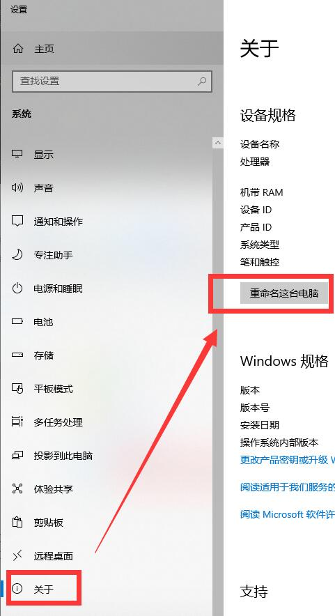

    

## 使用流程
    1.本地以全新的阿里云 windows server 2022  数据中心版 64位中文版 作为示例
        
    2.先打开M3U8批量下载器，并出现【http接口初始化完成，端口：8787】表示软件启动成功
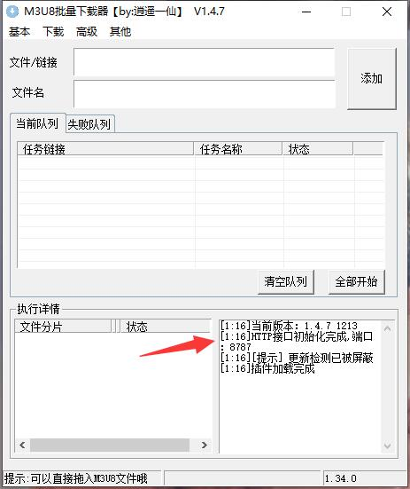
    
    3.运行server.exe，出现【开启代理成功】表示软件启动成功
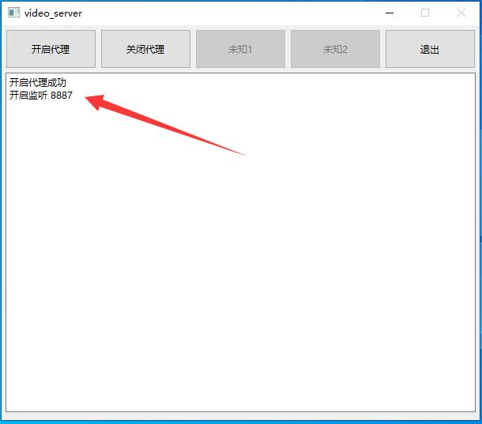

    4.所有初始工作已经做完，这时可以随意打开浏览器播放视频，会自动捕获视频并进行下载
    
    5.退出时必须点击退出按钮来退出，否则程序依旧会在后台运行
    
## 初次使用的额外操作
    1.出现【开启代理失败】
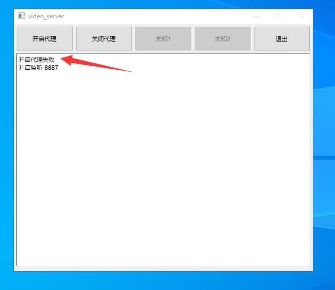

        1.1. 找到网络图标右键，点击【打开"网络和Internet"设置】
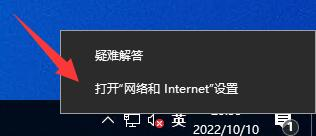

        1.2. 进行如下设置后点击保存
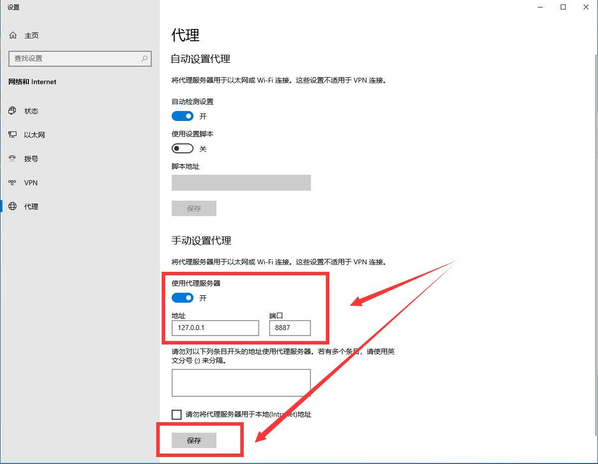

        1.3. 点击退出按钮重新打开软件可解决
    2.网页出现【你的连接不是专用连接】
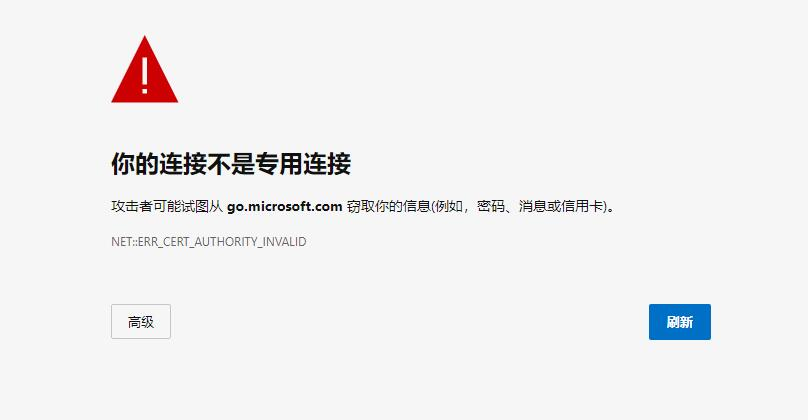

        2.1. 打开电脑的用户目录，会生成了一个【.mitmproxy】的文件夹，点击进去
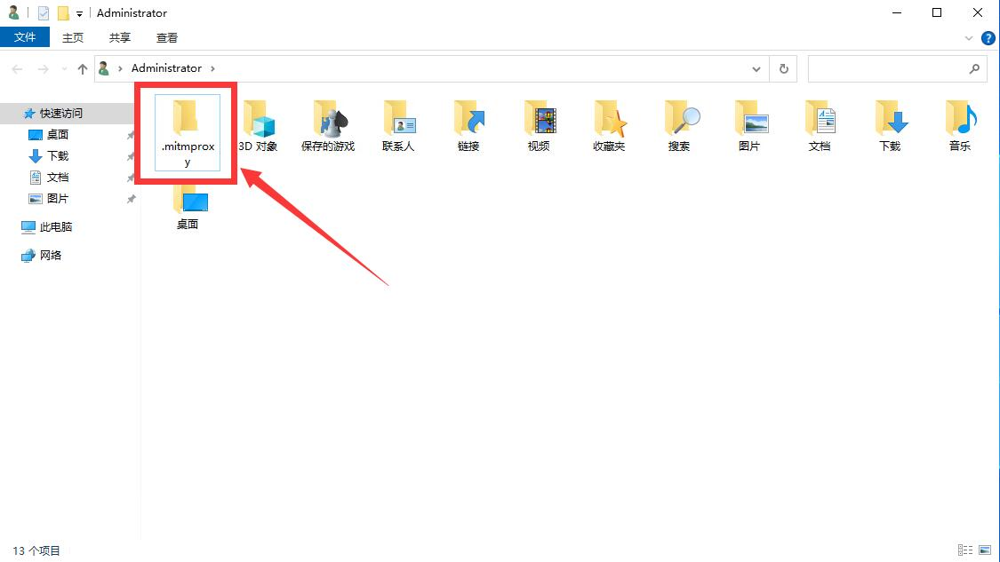

        2.2. 双击【mitmproxy-ca-cert.p12】开始安装证书。如果时间不是当前时间，需要先删除上一步的【.mitmproxy】的文件夹，然后点击server.exe退出按钮，再重新打开server.exe
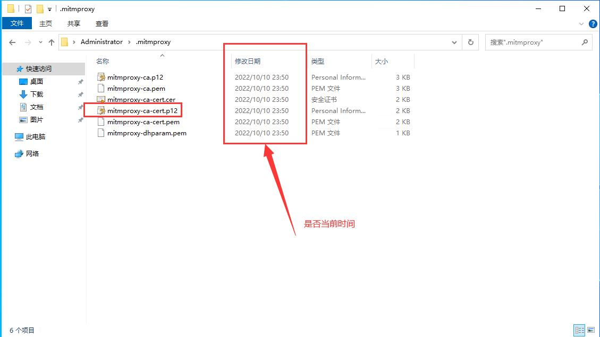

        2.3. 按照下方流程安装
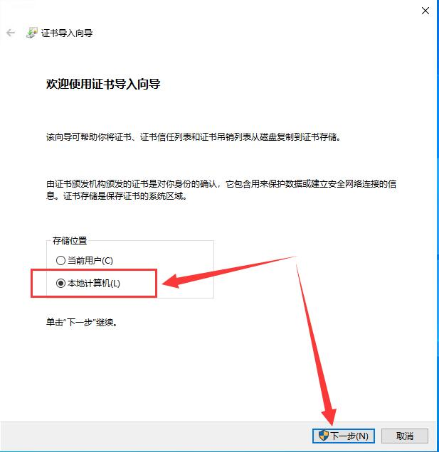

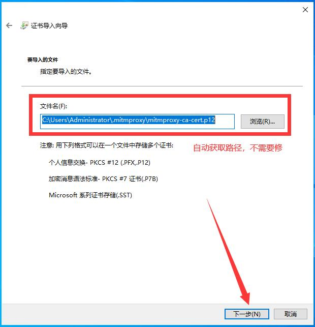

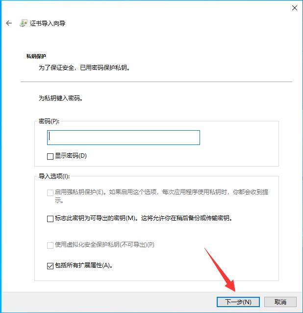

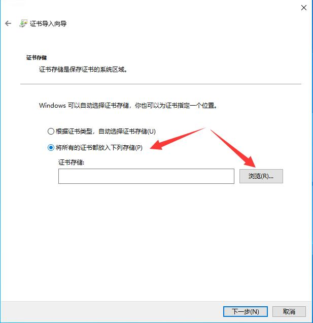

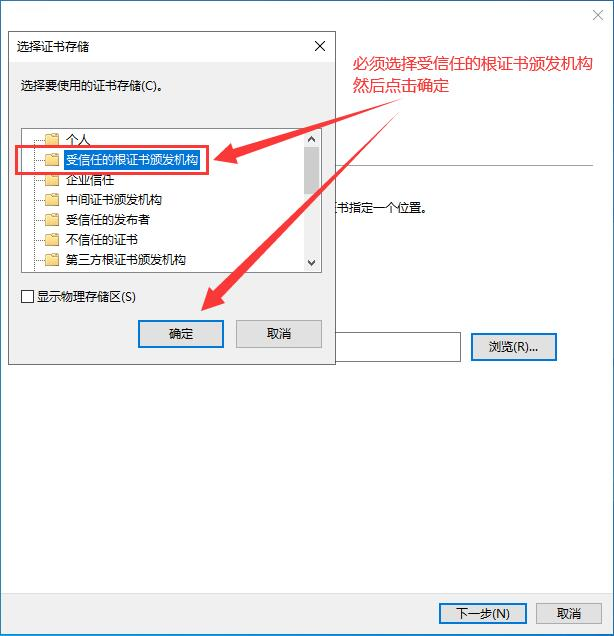

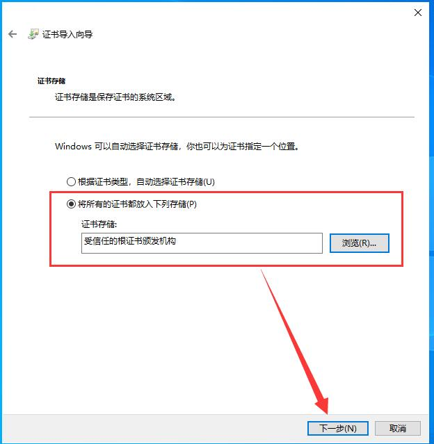

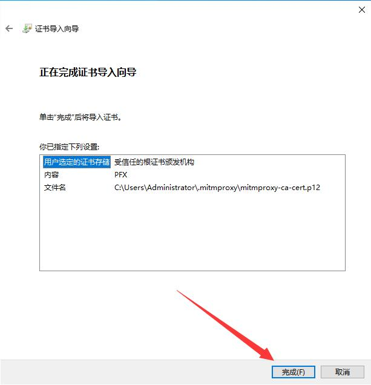

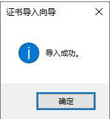

        2.4. 最后出现【导入成功】即证书安装完成
 
## 外部代理
    1.部分网站需要代理才能访问，此时拦截则需要设置外部代理，要开启外部代理，需要先设置特定的环境变量
    
    2.在系统变量中，新建一个变量名为【PYTHON_VIDEO_SERVER_PORT】变量值为外部代理的http端口
        例如：
            Clash一般为7890
            v2rayN一般为10809
            不开启填写0
        
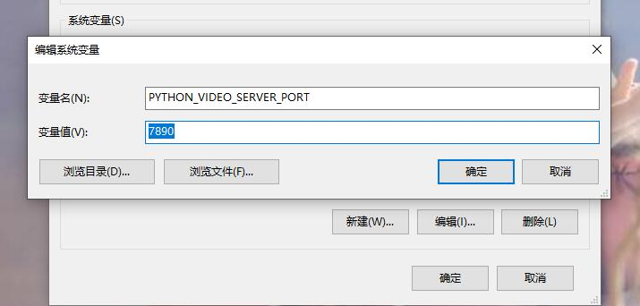
    
    3.确定保存后，打开server，显示【外部代理启动成功】则表示设置正确
    
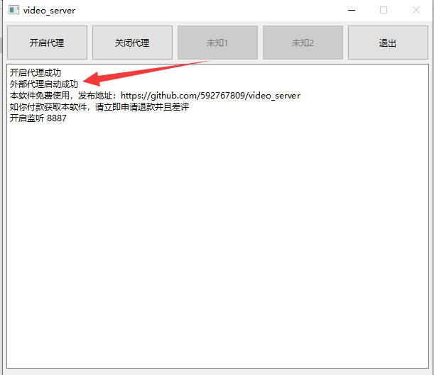
 

## 微信视频号使用方法
    1.首先退出你的微信客户端

    2.进入到路径C:\Users\【用户名】\AppData\Roaming\Tencent\WeChat\radium\web\profiles\multitab\Cache\Cache_Data
    然后删除里面的所有东西
    部分高版本的微信可能路径不一样，例如
    3.9.7.29路径如下
    C:\Users\【用户名】\AppData\Roaming\Tencent\WeChat\radium\web\profiles\multitab_【32位英文数字】\Cache\Cache_Data
    3.9.12.17路径如下
    C:\Users\【用户名】\AppData\Roaming\Tencent\WeChat\radium\web\profiles\multitab_【32位英文数字】\Code Cache\js

    3.接着先打开video_server工具

    4.最后再打开微信客户端，如果出现如下图的【微信：HOOK功能已开启】，说明加载成功(部分用户可能需要点击视频号详情时才出现)
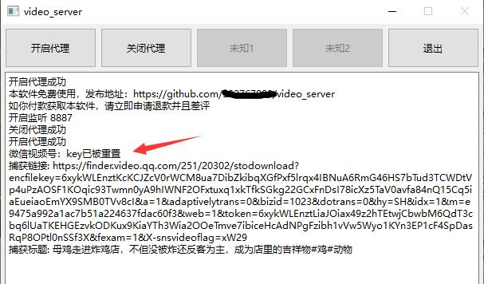
    
    5.此时随意打开微信视频号的视频播放，即可拦截下载

## 绕过地址
    1.部分直播或者视频采用flv或者mp4等非分段时，如果拦截地址会导致页面异常，可以使用绕过host方式

    2.打开同目录的host.txt文件

    3.添加对应的host地址，一个一行，如：
`www.xxxxxx1.com

img.xxxxxx2.com

video.xxxxxx3.com

xxxxy.xxxxxx4.com`

## 系统简介
    1.在观看视频的过程中，使用server进行抓包，当拦截到指定的数据时，将数据推送到本地的服务器处理
    
    2.本地服务器判断hls类型，如果是标准的hls，那么直接推送到m3u8批量下载器去处理下载任务
    
    3.如果是自定义的hls，那么就将任务推送到本地的下载器后台接管下载任务，下载完成后，会推送一个合并任务到m3u8批量下载器进行文件合并，最后自动关闭窗口
    
    4.如果是mpd类型，会调用N_m3u8DL-RE下载
    
    5.使用本地下载下载器的任务，下载的缓存文件是不会自动删除，需要合并完成后手动删除

## 鸣谢
    1.感谢mpd类型命令行下载工具 https://github.com/nilaoda/N_m3u8DL-RE
  
    
# 更新日志

### 2022.10.23
    1.优化文件名显示
    
### 2022.10.24
    1.增加外部代理功能

### 2023.6.1
    1.增加微信视频号功能

### 2023.6.1
    1.增加微信视频号自动探测视频是否加密

### 2023.6.11
    1.增加显示后台下载文件路径
    2.跳过已存在文件

### 2023.6.21
    1.当文件名为空时使用自动填充的名称
    2.智能拉取最高清晰度视频

### 2023.6.27
    1.优化下载逻辑，更快的下载速度
    2.下載后检验视频完整性,错误的视频将自动移除

### 2023.7.3（v1.0.0）
    1.增加版本号记录

### 2023.7.7（v1.0.1）
    1.修复视频号视频拦截失效问题
    2.增加测试拦截微信直播弹幕发言部分
    3.增加host.txt文件，可以自定义绕过策略

### 2023.7.7（v1.0.2）
    1.修复视频号视频名称过长无法保存问题
    2.界面增加【复制】和【清空】按钮

### 2023.7.7（v1.0.3）
    1.增加视频号自动下载封面图片

### 2024.1.8（v1.0.4）
    1.修复部分视频key解密失败的问题

### 2024.1.10（v1.0.5）
    1.优化代码逻辑

### 2024.1.12（v1.0.6）
    1.修复视频号部分视频无法捕获问题

### 2024.3.26（v1.0.7）
    1.修复视频号解密失效问题

### 2024.8.5（v1.0.8）
    1.修复视频号无法hook问题
    2.增加v13类型视频下载

### 2024.9.9（v1.0.9）
    1.增加视频号进入直播间时显示直播地址
    2.增加视频号进入用户主页时进行批量下载发布的视频
    3.增加视频号下载视频时，子线程修改为守护线程
    4.修改视频号下载视频时，使用aria2c进行下载

### 2024.10.7（v1.0.10）
    1.增加视频号批量按钮，点击可开关视频号批量功能

### 2024.10.31（v1.0.11）
    1.增加微信视频号hook强度

### 2025.04.16（v1.0.12）
    1.修改拦截逻辑，减少拦截到无用的链接
    2.修复部分站点逻辑

### 2025.04.16（v1.0.13）
    1.修改视频号下载命名逻辑

### 2025.04.16（v1.0.14）
    1.适配win11电脑运行
    2.增加捕获个人收藏页
    3.优化批量下载逻辑

### 2025.09.22（v1.0.15）
    1.开关按钮在软件打开时默认关闭
    2.增加视频号封面下载选项按钮

### 2025.10.24（v1.1.0）
    1.修复外部代理设置了后不生效，导致无法联网的问题